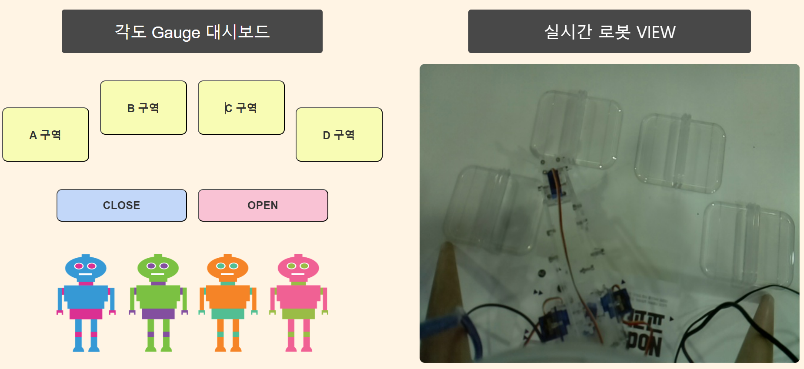
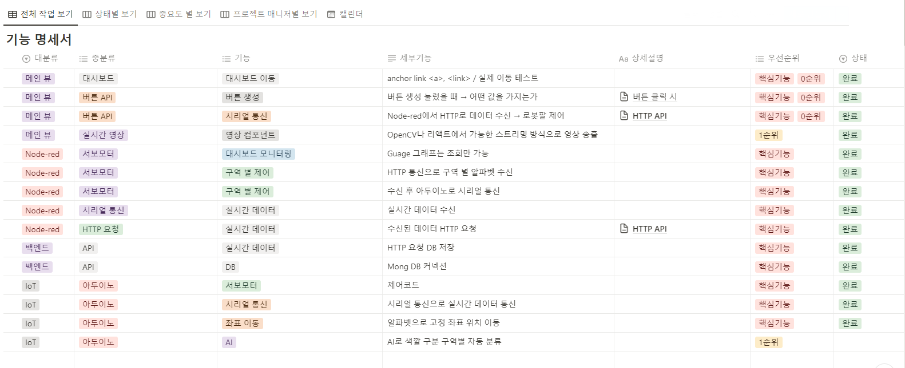
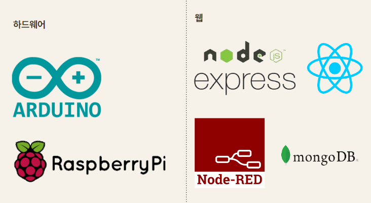

# IoT 로봇팔 프로젝트


---
### 📌Duration <br>
2023.07.10 ~ 14

### 📌프로젝트 인원
**Collaborator**

[](https://github.com/HuiJeong98)
[](https://github.com/JuYeung2)
[](https://github.com/Isak-toast)
<br>


### 📌프로젝트 기획
목적
- 단순 노동에 소요되는 지속적인 인건비 지출을 최소화하고, 최소한의 비용으로 최대 효율을 달성하기 위해 기계적인 시스템을 구현하고, 이를 통해 IOT의 동작 방식과 데이터 이동 흐름을 이해하고 경험하는 것

목표
- 로봇 팔을 이용하여 정확한 위치에 도달하는 시스템을 설계하여, 자동화 시스템에 대해 기계의 제어와 관리를 어떻게 이용하는지 알아보기 위해 진행
- 이 프로젝트를 진행하면서 측정한 데이터 값을 활용하고 사용자에게 보여지는 지를 파악하고, 간략하게나마 IOT의 흐름을 읽는 것을 기대하고 있음.
- 웹 환경과 IoT 기기 간의 상호 연결성을 통해서 관제 시스템을 간접적으로 경험해볼 수 있음

### 📌프로젝트 설계


`예정 프로젝트 목표치 95% 달성`

### 📌기술 스택



### 📌실행 환경 <br>

1. frontend 서버 실행
```bash
# front folder
$ npm run start # react 실행
```

3. backend 서버 실행
```bash
# back folder
$ npm run start # express 실행
```

4. 아두이노
```bash
# iot folder
아두이노 보드에 myArm.ino 프로그램 업로드
```

5. 라즈베리파이 
```bash
# iot folder

# streaming 서버 실행
$ python streaming.py

# node-red 실행
#nodejs 다운로드 :
$ bash <(curl -sL https://raw.githubusercontent.com/node-red/linux-installers/master/deb/update-nodejs-and-nodered)

#npm / node-red 다운로드
$ sudo npm install -g --unsafe-perm node-red

$ node-red-start # node-red 실행
```
    